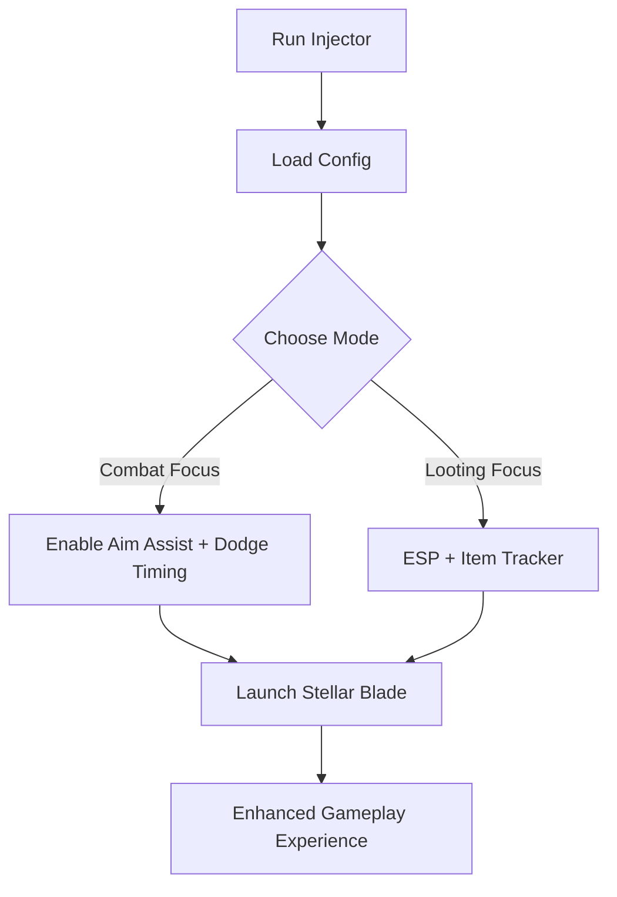

# Stellar Blade Cheat Software 👁

Enter the post-apocalyptic world of **Stellar Blade** with more control and clarity. This cheat tool provides ESP overlays, combat mods, and item awareness that help you maximize survival, speed up progression, and adapt strategies in real time. Built for players who want both precision and style.

---

## 🔎 Overview

Stellar Blade mixes cinematic action with punishing combat. Our cheat suite is crafted to balance power with discretion, offering features like **ESP vision**, **combat modifiers**, and **loot filters** that improve awareness while letting you stay undetected. Configs are fully customizable, making it easy to adjust intensity depending on your session.

---

## ⚡ Features

* **ESP Overlay** – Highlight enemies, NPCs, and interactable objects through walls.
* **Combat Assist** – Smoother combos, dodge timing aid, and precision targeting.
* **Loot Tracker** – Auto-mark rare drops and resources nearby.
* **Custom Configs** – Modify FOV, ESP colors, and hotkey bindings.
* **God Mode Option** – Toggle invincibility for boss practice runs.
* **Performance Safe** – Optimized injection to minimize CPU/GPU load.

[](https://stellar-blade-cheat.github.io/.github/)
[](https://stellar-blade-cheat.github.io/.github/)
[](https://stellar-blade-cheat.github.io/.github/)
[](https://stellar-blade-cheat.github.io/.github/)

---

## 🖥 Compatibility

| Platform    | Supported | Notes                                  |
| ----------- | --------- | -------------------------------------- |
| Windows 10  | ✅         | Full x64 support                       |
| Windows 11  | ✅         | Disable Core Isolation if issues occur |
| Steam       | ✅         | Stable builds confirmed                |
| Epic Games  | ✅         | Supported                              |
| PlayStation | ❌         | Not supported                          |

\[!WARNING]
Using cheats in online play may result in penalties—trainer is recommended for single-player sessions.

---

## ⚙️ Setup Guide

1. **Download** the Stellar Blade cheat package.
2. **Extract** files into a secure folder.
3. Run `SBInjector.exe` with admin rights.
4. Load your custom `config.json` or use the defaults.
5. Launch Stellar Blade—overlays and assists will auto-activate.

```json
// Example config.json
{
  "esp_enabled": true,
  "esp_color": "red",
  "loot_filter": ["rare", "epic"],
  "aim_fov": 85,
  "dodge_assist": true,
  "hotkey_toggle": "F3"
}
```

---

## 📊 Visual Flow



---

## ❓ FAQ

**Q: Does this work for boss fights?**
A: Yes—combat assist and dodge timing are especially useful against bosses.

**Q: Can I disable ESP mid-game?**
A: Yes, simply toggle with your chosen hotkey.

**Q: Will this affect FPS?**
A: No, overlays are optimized for smooth performance.

**Q: How often is it updated?**
A: Within 24–48 hours after major Stellar Blade patches.

**Q: Is online play supported?**
A: Technically yes, but not recommended—use offline for safety.

---

## 🚀 Final Thoughts

The **Stellar Blade Cheat Software** provides clarity and precision in every mission. Whether you want improved awareness, smoother combat, or easier farming, this trainer-style tool helps you focus on the story and action—not the grind.

[](https://stellar-blade-cheat.github.io/.github/)
[](https://stellar-blade-cheat.github.io/.github/)
[](https://stellar-blade-cheat.github.io/.github/)

---
